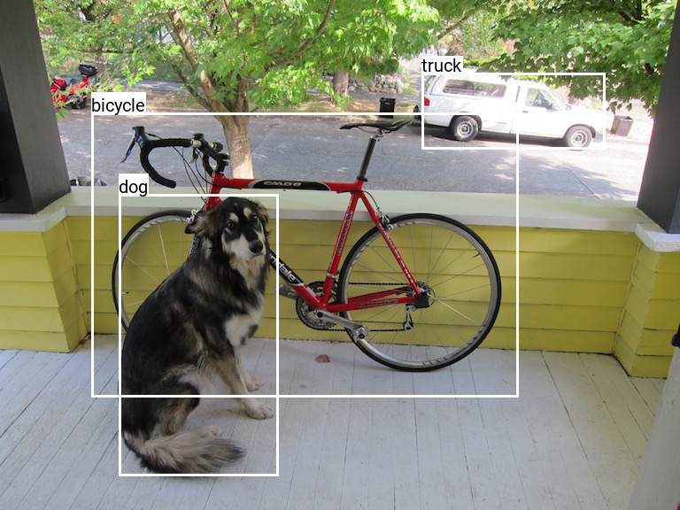
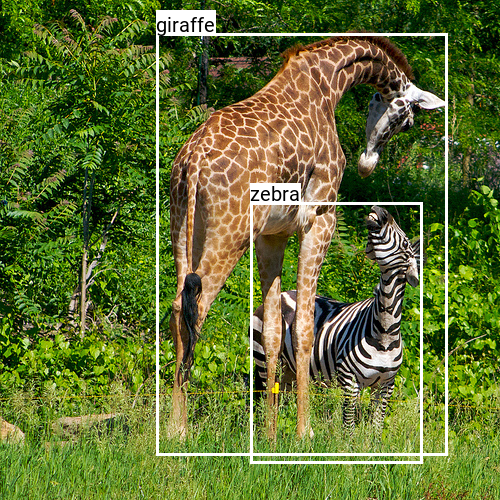

# YOLOv3 in PyTorch

The repo implements YOLOv3 using the PyTorch framework. Both inference and training modules are implemented.

## Table of Contents

- [Introduction](#introduction)
- [Getting Started](#getting-started)
  * [Sample outputs](#sample-outputs)
- [Prerequisites](#prerequisites)
- [Structure](#structure)
- [Usage](#usage)
  * [Training](#training)
    + [Training on COCO dataset](#training-on-coco-dataset)
  * [Inference](#inference)
  * [Options](#options)
- [Results](#results)
  * [Speed](#speed)
  * [COCO Average Precision at IoU=0.5 (AP<sub>50</sub>)](#coco-average-precision-at-iou-05--ap-sub-50--sub--)
- [Authors](#authors)
- [License](#license)
- [Credits](#credits)


## Introduction

You-Only-Look-Once (YOLO) newtork was introduced by Joseph Redmon et al. 
Three versions were implemented in C, with the framework called [darknet](https://github.com/pjreddie/darknet) (paper: [v1](https://arxiv.org/abs/1506.02640), [v2](https://arxiv.org/abs/1612.08242), [v3](https://arxiv.org/abs/1804.02767)).

This repo implements the Nueral Network (NN) model of YOLOv3 in the PyTorch framework, aiming to ease the pain when the network needs to be modified or retrained.

There are a number of implementations existing in the open source domain, 
e.g., [eriklindernoren/PyTorch-YOLOv3](https://github.com/eriklindernoren/PyTorch-YOLOv3),
[ayooshkathuria/pytorch-yolo-v3](https://github.com/ayooshkathuria/pytorch-yolo-v3),
[ultralytics/yolov3](https://github.com/ultralytics/yolov3), etc.
However, majority of them relies on "importing" the configuration file from the original darknet framework.
In this work, the model is built from scratch using PyTorch.

Additionally, both inference and training part are implemented. 
The original weights trained by the authors are converted to .pt file.
It can be used as a baseline for transfer learning.

**This project is licensed under BSD 3-Clause "Revised" License.**

## Getting Started

Before cloning the repo to your local machine, make sure that `git-lfs` is installed. See details about `git-lfs`, see [this link](https://www.atlassian.com/git/tutorials/git-lfs#installing-git-lfs).

After `git-lfs` is installed. Run the following command to see sample detection results.
```
git lfs install
git clone https://github.com/westerndigitalcorporation/YOLOv3-in-PyTorch
cd YOLOv3-in-PyTorch
pip install -r requirements.txt
cd src
python3 main.py test --save-img

```
Detections will be saved in the `output` folder.

### Sample outputs






## Prerequisites

The repo is tested in `Python 3.7`. Additionally, the following packages are required: 

```
numpy
torch>=1.0
torchvision
pillow
```

## Structure

The repo is structured as following:
```
├── src
│   └── [source codes]
├── weights
│   ├── yolov3_original.pt
├── data
│   ├── coco.names
│   └── samples
├── fonts
│   └── Roboto-Regular.ttf
├── requirements.txt
├── README.md
└── LICENSE
```

`src` folder contains the source codes. 
`weights` folder contains the original weight file trained by Joseph Redmon et al.
`data/coco.names` file lists the names of the categories defined in the COCO dataset. 
`fonts` folder contains the font used by the Pillow module.

## Usage

### Training

The weight trained by Joseph Redmon et al. is used as a starting point. 
The last few layers of the network can be unfreezed for transfer learning or finetuning. 

#### Training on COCO dataset

To train on COCO dataset, first you have to download the dataset from [COCO dataset website](http://cocodataset.org/#home).
Both images and the annotations are needed. 
Secondly, `pycocotools`, which serves as the Python API for COCO dataset needs to be installed.
Please follow the instructions on [their github repo](https://github.com/cocodataset/cocoapi) to install `pycocotools`.

After the COCO dataset is properly downloaded and the API setup, the training can be done by:

```
python3 main.py train --verbose --img-dir /path/to/COCO/image/folder --annot-path /path/to/COCO/annotation/file --reset-weights
```
You can see the network to converge within 1-2 epochs of training.

### Inference

To run inference on one image folder, run:

```
python3 main.py test --img-dir /path/to/image/folder --save-det --save-img
```

The `--save-det` option will save a `json` detection file to the output folder. The formate matches COCO detection format for easy benchmarking.
The `--save-img` option

### Options

`main.py` provides numerous options to tweak the functions. Run `python3 main.py --help` to check the provided options.
The help file is pasted here for your convenience. But it might not be up-to-date.

```
usage: main.py [-h] [--dataset DATASET_TYPE] [--img-dir IMG_DIR]
               [--batch-size BATCH_SIZE] [--n-cpu N_CPU] [--img-size IMG_SIZE]
               [--annot-path ANNOT_PATH] [--no-augment]
               [--weight-path WEIGHT_PATH] [--cpu-only] [--from-ckpt]
               [--reset-weights] [--last-n-layers N_LAST_LAYERS]
               [--log-dir LOG_DIR] [--verbose] [--debug] [--out-dir OUT_DIR]
               [--save-img] [--save-det] [--ckpt-dir CKPT_DIR]
               [--save-every-epoch SAVE_EVERY_EPOCH]
               [--save-every-batch SAVE_EVERY_BATCH] [--epochs N_EPOCH]
               [--learning-rate LEARNING_RATE] [--class-path CLASS_PATH]
               [--conf-thres CONF_THRES] [--nms-thres NMS_THRES]
               ACTION

positional arguments:
  ACTION                'train' or 'test' the detector.

optional arguments:
  -h, --help            show this help message and exit
  --dataset DATASET_TYPE
                        The type of the dataset used. Currently support
                        'coco', 'caltech' and 'image_folder'
  --img-dir IMG_DIR     The path to the folder containing images to be
                        detected or trained.
  --batch-size BATCH_SIZE
                        The number of sample in one batch during training or
                        inference.
  --n-cpu N_CPU         The number of cpu thread to use during batch
                        generation.
  --img-size IMG_SIZE   The size of the image for training or inference.
  --annot-path ANNOT_PATH
                        TRAINING ONLY: The path to the file of the annotations
                        for training.
  --no-augment          TRAINING ONLY: use this option to turn off the data
                        augmentation of the dataset.Currently only COCO
                        dataset support data augmentation.
  --weight-path WEIGHT_PATH
                        The path to weights file for inference or finetune
                        training.
  --cpu-only            Use CPU only no matter whether GPU is available.
  --from-ckpt           Load weights from checkpoint file, where optimizer
                        state is included.
  --reset-weights       TRAINING ONLY: Reset the weights which are not fixed
                        during training.
  --last-n-layers N_LAST_LAYERS
                        TRAINING ONLY: Unfreeze the last n layers for
                        retraining.
  --log-dir LOG_DIR     The path to the directory of the log files.
  --verbose             Include INFO level log messages.
  --debug               Include DEBUG level log messages.
  --out-dir OUT_DIR     INFERENCE ONLY: The path to the directory of output
                        files.
  --save-img            INFERENCE ONLY: Save output images with detections to
                        output directory.
  --save-det            INFERENCE ONLY: Save detection results in json format
                        to output directory
  --ckpt-dir CKPT_DIR   TRAINING ONLY: directory where model checkpoints are
                        saved
  --save-every-epoch SAVE_EVERY_EPOCH
                        TRAINING ONLY: Save weights to checkpoint file every X
                        epochs.
  --save-every-batch SAVE_EVERY_BATCH
                        TRAINING ONLY: Save weights to checkpoint file every X
                        batches. If value is 0, batch checkpoint will turn
                        off.
  --epochs N_EPOCH      TRAINING ONLY: The number of training epochs.
  --learning-rate LEARNING_RATE
                        TRAINING ONLY: The training learning rate.
  --class-path CLASS_PATH
                        TINFERENCE ONLY: he path to the file storing class
                        label names.
  --conf-thres CONF_THRES
                        INFERENCE ONLY: object detection confidence threshold
                        during inference.
  --nms-thres NMS_THRES
                        INFERENCE ONLY: iou threshold for non-maximum
                        suppression during inference.
```

## Results

### Speed

Execution time is measured using the desktop machine described below ("My Machine").
Test case is detecting COCO val2017 dataset with batch size of 1.
The data in the "Time from paper (ms)" column is taken from the original YOLOv3 paper 
([link](https://arxiv.org/pdf/1804.02767.pdf)), which is not verified on My Machine.

Execution time (ms) per image:

| Input size 	|  Avg 	| Std dev 	| From paper 	|
|:----------:	|:----:	|:-------:	|:----------:	|
|   608x608  	| 26.3 	|   3.8   	|     51     	|
|   416x416  	| 17.8 	|   3.3   	|     29     	|
|   320x320  	| 15.1 	|   2.9   	|     22     	|


The configuration of My Machine: 
* CPU: Intel Core i7-8086K
* GPU: Nvidia GeForce GTX 1080 Ti
* Memory: 32GB

### COCO Average Precision at IoU=0.5 (AP<sub>50</sub>)

The figure of merit used in object detection is COCO AP. 
For a good explanation of COCO AP (also called mAP), see this [post](https://medium.com/@jonathan_hui/map-mean-average-precision-for-object-detection-45c121a31173).

Especially, AP<sub>50</sub> is extensively used by Redmon et al. to compare the performance of different models.
Here we inherit this metric. AP<sub>50</sub> is measured using COCO val2017 dataset.

AP<sub>50</sub> on COCO val2017:

| input size 	| Retrained weight PyTorch 	| Original weight PyTorch 	|       From paper*     	|
|:----------:	|:------------------------:	|:-----------------------:	|:-----------------------:	|
|   608x608  	|           58.0           	|           55.5          	|           57.9          	|
|   416x416  	|           56.4           	|           52.8          	|           55.3          	|
|   320x320  	|           50.3           	|           47.0          	|           51.5          	|


\* metric extracted from paper and not verified.


## Authors

* **Haoyu Wu** - [wuhy08](https://github.com/wuhy08)

## License

This project is licensed under BSD 3-Clause "Revised" License - see the [LICENSE](LICENSE) file for details

## Credits

Original YOLOv3 Paper: [link](https://arxiv.org/pdf/1804.02767.pdf)

YOLOv3 C++ implementation: [link](https://github.com/pjreddie/darknet)
